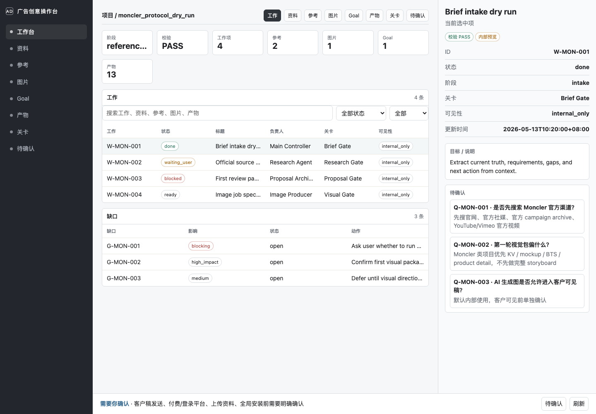
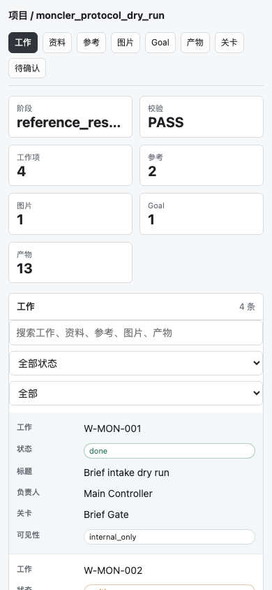

# Ad Creative Orchestrator

[](https://github.com/papperrollinggery/ad-creative-orchestrator/actions/workflows/check.yml)
[](LICENSE)

Local-first, Codex-first workflow for advertising creative operations.

It turns messy briefs, references, image assets, PPT drafts, review gates, and client-visible risk into a traceable project folder.

## Quickstart

From GitHub to a working demo:

```bash
git clone https://github.com/papperrollinggery/ad-creative-orchestrator.git
cd ad-creative-orchestrator
python3 -m venv .venv
source .venv/bin/activate
python -m pip install --upgrade pip
python -m pip install .
adco --version
adco quickstart /tmp/adco-demo --no-open
adco quickstart /tmp/adco-demo-json --no-open --json
adco status /tmp/adco-demo
adco next /tmp/adco-demo
adco open-dashboard /tmp/adco-demo
adco validate /tmp/adco-demo
adco check
adco release-status
```

Expected:

```text
QUICKSTART=PASS
VALIDATION=PASS
RUN_CHECKS=PASS
```

Open:

```text
/tmp/adco-demo/AD-creative/handoff/操作台.html
```

For a real project:

```bash
adco init <project_dir>
adco run <project_dir> --material <material_file_or_folder>
adco open-dashboard <project_dir>
adco next <project_dir>
```

Every initialized project gets a root `AGENTS.md`. If the directory already has one, adco leaves it untouched and writes `AD-creative/orchestrator/AGENTS.merge_suggestion.md`; merge the suggested rules into the root file, then run `adco validate` again.

## What You Get

- `AD-creative/orchestrator/`: structured source of truth for requirements, gaps, work, artifacts, Gates, versions.
- `AD-creative/handoff/`: non-developer dashboard, project board, pending decisions, client question script.
- `00_项目资料_ProjectMaterials/` through `05_最终交付_FinalDelivery/`: human-facing folders with auto-updated `目录索引.md` files that point to the current materials, references, assets, WIP, client review drafts, and final delivery artifacts.
- Project-root `AGENTS.md`: project-local Codex rules for new threads, safety stops, handoff files, and required Gates.
- `adco creative-proposal`: internal strategy/proposal draft control for challenge, insight, creative idea, evidence mapping, and client questions.
- `adco creative-quality-gate`: proposal quality checks for structure, traceability, evidence, and professional readiness, separate from human/client approval.
- `adco quickstart`: one-command first run that creates a demo, validates it, opens the dashboard, and prints next steps.
- `adco demo`: one-command local demo with no real client material.
- `adco sample`: deterministic sample project generator.
- `adco run`: register real materials and produce first-pass requirements, gaps, dashboard, and council report. The launcher then creates the customer-readable text framework and stops before PPT.
- `adco specialist-handoff` / `adco specialist-adopt`: neutral versioned specialist exchange; DIRcreative is the first profile, while ADCO remains the adoption/version/client-readiness owner.
- `adco status`: show validation, blockers, pending confirmations, and the next action.
- `adco next`: print the next safe action and automation-friendly next status.
- `adco release-status`: summarize local release readiness and remote blockers.
- `adco docs`: print local docs, template, skill draft paths, and quickstart commands.
- Gate commands for references, search, visual assets, PPT/client pack, and non-developer handoff.

## Safety Model

- This is not a video or image generator. Route film work through `adco.specialist-exchange` (for example the `dircreative.film-preproduction` profile), image/KV/backgrounds to image tooling, and keep ADCO as the only client/version/PPT/FinalDelivery control plane.
- Client-facing files are never sent automatically.
- External uploads, paid/login/private account actions, global skill installs, and destructive overwrites require explicit human confirmation.
- AI/generated images stay `internal_only` until visual QA and a hash-bound authorization receipt exist. A naked `approval=PASS` is not authorization.
- A goal plan cannot self-stamp independent review. Only a dedicated reviewer record bound to a real target hash counts as adversarial evidence.
- `VALIDATION=PASS` means the project structure and traceability links are valid. It is not customer creative quality approval.
- `creative-quality-gate` can only mark an internal proposal draft as structurally/professionally ready for review. It does not certify taste, client preference, business impact, or final approval.
- `client-pack-gate` means ready for independent human review, not send-ready. It binds all exact-current inputs to a package digest. `client-send-readiness-gate` separately requires that fresh digest, an independent manual-review receipt, and explicit send authorization all agree; it never sends.
- `handoff-readiness-gate` proves only that another non-developer operator can continue internally. It does not prove PPT, Client Pack, FinalDelivery, or send readiness.

项目仍是本地优先的 Codex 工作流，不是独立 SaaS；全局 Skill 只在用户明确授权后通过 `adco install-skill` 同步。

## Why This Exists

广告创意项目最容易失控的地方不是“写几页方案”，而是客户资料、补充反馈、参考来源、AI 图、PPT、客户可见风险在多个版本里互相污染。

Ad Creative Orchestrator 把这些变成本地文件协议和 Gate：

```text
资料 → 需求/缺口 → 客户可读文本框架 → hash-bound 人工确认 → 不可变 PPT 版本 → exact-current 客户包绑定 → 独立人工审阅/发送授权 → 发送准备 Gate → 反馈合并
```

运行时固定为 `P0 truth/lock → P1 client outline → P2 hash confirmation → P3 creative/reference/neutral specialist → P4 immutable PPT → P5 language/visual/authorization/editability → P6 fresh Client Pack binding → P7 independent review/send readiness（不发送）→ P8 feedback/next version`。P4、P6、P7 是三个独立状态，不得合并成一个“交付完成”阶段。

所有客户可见内容必须能追溯到 requirement / reference / asset / Gate。

## Demo





可复现命令见 `docs/operating/demo_script.md`。

首跑输出见 `docs/assets/first-run-transcript.md`。

## Install

源码安装：

```bash
python3 -m pip install .
```

可用命令：

```bash
adco --help
adco --version
adco doctor
adco doctor --json
adco release-status
adco release-status --json
adco docs
adco docs --json
adco init <项目目录>
adco-init <项目目录>
adco quickstart [项目目录]
adco quickstart [项目目录] --json
adco demo [项目目录]
adco sample <项目目录>
adco support-bundle <项目目录>
adco support-bundle <项目目录> --json
adco open-dashboard <项目目录>
adco audit-dashboard <项目目录> --render --json
adco run <项目目录> --material <资料文件或文件夹>
adco goal-plan <项目目录> --title "<目标标题>" --objective "<目标内容>"
adco thread-plan <项目目录> --title "<目标标题>" --objective "<目标内容>" --roles brand_client,copy_creative,qa_review
adco profile-analyze <项目目录> --source-id <SRC-ID> --brand "<品牌>" --company "<公司>"
adco hygiene <项目目录>
adco goal-run <项目目录> --goal-id latest --max-steps 3
adco migrate-control-plane <项目目录> --dry-run
adco migrate-control-plane <项目目录>
adco agency-audit <项目目录>
adco creative-proposal <项目目录> [--work-id <id>] [--json]
adco creative-quality-gate <项目目录>
adco preflight-skill <项目目录> --work-id <WORK-ID> --requested-skill <skill> --skill-path <SKILL.md> --rules-read "<规则>" --derived-gates "<gate>"
adco specialist-handoff <项目目录> --work-id <WORK-ID> --profile-id dircreative.film-preproduction --objective "<目标>" --input-artifact <ART-ID> --expected-output film.story_package --descriptor <descriptor.json>
adco specialist-adopt <项目目录> --handoff <handoff.json> --receipt <receipt.json> --decision partial_adopt --reason "<理由>" --map-output <DIR-ID=AD-creative/film/output.md>
adco preflight-asset <项目目录> --work-id <WORK-ID> --source-scope "<本地/browser/download/generated 范围>"
adco confirm-client-outline <项目目录> --confirmed-by "<人工确认者>" --confirmed-at <iso_time> --evidence-ref "<user_confirmation:id|client_confirmation:id>"
adco client-outline-gate <项目目录>
adco client-language-gate <项目目录>
adco asset-current-manifest <项目目录>
adco browser-asset-intake <项目目录> --work-id <WORK-ID> --source Grok --browser-evidence "<证据>"
adco visual-layout-gate <项目目录>
adco final-delivery-lock <项目目录>
adco dedupe-audit <项目目录>
adco cleanup-plan <项目目录>
adco dispatch-record <项目目录> --work-id <WORK-ID> --lane-id <LANE-ID> --real-thread-id <thread_id> --title-verified-at <iso_time> --dispatch-evidence "<readback evidence>" --absolute-deadline-at <iso_time>
adco creative-doctor
adco creative-run <项目目录> --kind ads --work-id <工作ID> --brief-file <brief.md>
adco import-creative-production <项目目录> --run-dir <run目录> --kind ads --slot-prefix CP
adco status <项目目录>
adco status <项目目录> --json
adco next <项目目录>
adco next <项目目录> --json
adco validate <项目目录>
adco validate <项目目录> --json
adco check
```

兼容入口仍保留：`adco-init`、`adco-check`、`adco-validate`。

未安装时先执行：

```bash
python3 -m pip install .
```

当前目标：

```text
拿到客户资料后，Codex 能稳定完成：
Intake → 缺口判断 → 客户可读文本框架/SlideSpec → 人工确认文本 hash → client-outline-gate → 参考/专项/视觉按需推进 → 不可变 PPT vNNN → exact-current package binding → 独立 review + 发送授权 → send-readiness → 反馈合并 → Skill 草稿沉淀
```

升级后的定位：

```text
adco 负责项目控制、可追溯策略/创意 proposal 草稿、质量 Gate、交接和版本归属。
adco 不负责直接生成视频、图片或固定 PPT/DOCX/XLSX 模板。
proposal 默认是 internal draft；只有经过对应 Gate、参考/视觉复核和人工批准后，才可进入客户可见链路。
```

## 当前可操作入口

非开发者双击入口：

```text
启动广告创意项目.command
```

会弹出选择框：

```text
选择项目文件夹
选择资料文件或资料文件夹
填写本轮目标
自动打开 AD-creative/handoff/操作台.html
```

命令行入口：

```text
adco run <项目目录> --material <资料文件或文件夹>
```

它会自动：

```text
初始化项目结构
登记资料
抽取 requirements / gaps / current_truth
生成项目看板 / 待确认 / 客户追问
生成 AD-creative/handoff/操作台.html
生成客户可读文本框架并停在人工确认；不会自动生成 PPTX
运行三方议会 readiness 审核
运行 `adco validate`
```

新项目根目录会带 `AGENTS.md`。它让后续 Codex 线程先读项目规则、`AD-creative/orchestrator/` 和 `AD-creative/handoff/`，并遵守人工停点、客户可见限制、Gate 顺序和验证边界。初始化只创建缺失文件；如果目标目录已有 `AGENTS.md`，不会覆盖，内容不同时会写 `AD-creative/orchestrator/AGENTS.merge_suggestion.md` 供人工合并。

项目本地 Skill 草稿：

```text
skill_drafts/ad-creative-orchestrator/SKILL.md
```

项目模板：

```text
templates/project/
```

Moncler 文件流样例：

```text
examples/moncler_protocol_dry_run/
```

模拟真实客户项目：

```text
examples/simulated_qingling_outdoor_launch/
```

操作手册：

```text
docs/operating/install.md
docs/operating/demo_script.md
docs/operating/github_release_checklist.md
docs/operating/adoption_patterns.md
docs/operating/operating_manual.md
docs/operating/creative_proposal_quality_standard.md
docs/operating/dual_lane_goal_delivery_workflow.md
docs/operating/dual_lane_goal_optimization_plan.md
docs/operating/open_source_release_plan.md
```

真实项目启动 runbook：

```text
docs/operating/non_developer_quickstart.md
docs/operating/first_real_project_runbook.md
docs/operating/real_project_acceptance_criteria.md
docs/operating/authorization_policy.md
```

可操作性审核：

```text
docs/reviews/non_developer_handoff_readiness_review.md
docs/reviews/operational_readiness_review.md
docs/reviews/simulated_project_trial_review.md
```

GitHub 协作：

```text
.github/workflows/check.yml
.github/ISSUE_TEMPLATE/
.github/pull_request_template.md
```

验证与操作工具：

```text
adco check
adco --version
adco doctor --json
make check
make dist-check
make release-check
make package-smoke
adco doctor
adco support-bundle <项目目录>
adco support-bundle <项目目录> --json
adco open-dashboard <项目目录> --no-open
adco init <项目目录>
adco demo <项目目录> --no-open
adco status <项目目录> --json
adco validate <项目目录>
adco validate <项目目录> --json
adco sample <项目目录>
adco status <项目目录>
adco goal-plan <项目目录> --title <目标标题> --objective <目标内容>
adco thread-plan <项目目录> --title <目标标题> --objective <目标内容> --roles brand_client,copy_creative,qa_review
adco profile-analyze <项目目录> --source-id <SRC-ID> --brand <品牌> --company <公司>
adco hygiene <项目目录>
adco intake <项目目录>
adco creative-proposal <项目目录> [--work-id <id>] [--json]
adco creative-quality-gate <项目目录>
adco migrate-control-plane <项目目录> --dry-run
adco migrate-control-plane <项目目录>
adco agency-audit <项目目录>
adco preflight-skill <项目目录> --work-id <WORK-ID> --requested-skill <skill> --skill-path <SKILL.md> --rules-read "<规则>" --derived-gates "<gate>"
adco preflight-asset <项目目录> --work-id <WORK-ID> --source-scope "<本地/browser/download/generated 范围>"
adco confirm-client-outline <项目目录> --confirmed-by "<人工确认者>" --confirmed-at <iso_time> --evidence-ref "<user_confirmation:id|client_confirmation:id>"
adco client-outline-gate <项目目录>
adco client-language-gate <项目目录>
adco asset-current-manifest <项目目录>
adco browser-asset-intake <项目目录> --work-id <WORK-ID> --source Grok --browser-evidence "<证据>"
adco add-reference <项目目录> --url <https链接> --title <标题>
adco search-quality-gate <项目目录>
adco reference-pack-gate <项目目录>
adco add-asset <项目目录> --file <图片文件> --slot-id <槽位> --requirement-id <需求ID>
adco import-imagegen <项目目录> --slot-id <槽位> --selected
adco creative-doctor
adco creative-run <项目目录> --kind moodboard|ads|shots --work-id <工作ID> --brief-file <brief.md>
adco import-creative-production <项目目录> --run-dir <run目录> --kind moodboard|ads|shots --slot-prefix CP
adco visual-quality-gate <项目目录>
adco visual-layout-gate <项目目录>
adco film-quality-gate <项目目录>
adco export-pptx <项目目录>
adco check-pptx <项目目录> --file <PPTX文件>
adco client-pack-gate <项目目录>
adco client-send-readiness-gate <项目目录>
adco final-delivery-lock <项目目录>
adco dedupe-audit <项目目录>
adco cleanup-plan <项目目录>
adco handoff-readiness-gate <项目目录>
adco install-skill
adco install-skill --target ~/.skillshub/ad-creative-orchestrator
adco audit-dashboard <项目目录> --render
adco audit-dashboard <项目目录> --render --json
adco council <项目目录> --render-dashboard
adco-check
adco-init <项目目录>
adco-validate <项目目录>
```

## 推荐使用方式

最短方式：

```text
ad-creative:run

项目目录：<真实项目路径>
资料位置：<客户资料/会议记录/反馈所在文件夹或文件>
本轮目标：先完成需求整理、缺口判断、客户追问、下一步建议
```

在 Codex 中引用本地 Skill 草稿：

```text
使用 /Users/jinjungao/work/ad-creative-orchestrator/skill_drafts/ad-creative-orchestrator/SKILL.md
按 ad-creative:start 继续
```

Goal 模式推进：

```text
先读 docs/operating/dual_lane_goal_delivery_workflow.md
再复制 templates/project/AD-creative/orchestrator/goal_iteration_plan_template.md
按品牌深度研究 / 图片功能双泳道填写本轮 goal
每个阶段 Gate 前必须跑反驳性议会
没有反对意见、反驳路径、修订决议时，Gate 最高只能 PARTIAL_PASS
```

Codex Thread 执行层：

```text
adco goal-plan <项目目录> --title <目标标题> --objective <目标内容>
adco thread-plan <项目目录> --title <目标标题> --objective <目标内容> --roles brand_client,copy_creative,qa_review
```

`thread-plan` 只生成内部控制面：`thread_lane_plan.md`、role briefs、worker prompts、receipt 占位、`thread_registry.csv` 计划行和 cleanup 计划。主控线程先用这些 prompt 创建/复用 Codex Threads，收到 receipt 后再合并、验证、归档；客户可见 PPT/PDF/HTML 不得出现 prompt、thread、worker、lane plan 或执行步骤语言。
Threads 默认不启用。真实 worker 被采用前必须有 `real_thread_id`、dispatch receipt、title readback evidence、worker receipt、主控 adoption/rejection 和 cleanup 记录；`planned:*` 只是计划占位。主控在 dispatch 后保存 host scope baseline，在 reconcile 时用真实文件 diff 对照 receipt 与 exact write_scope，并生成 hash-bound host scope proof；worker 自报不能代替这份证明。固定轮询次数只是检查预算；进展中/静默/正在组织最终 receipt 要分开记录，最多一次有绝对截止时间的 extension 和一次带独立 dispatch proof/receipt path 的 rescue。

ThreadOps 分工规则：

```text
主控线程只负责拆分、分派、集成、验证、清理、汇报。
execution_worker 负责明确范围内的实现、文档修改、素材和产物制作。
read_only 只用于 explorer / reviewer / research / cold-review。
execution_worker 必须先写清 exact write_scope。
每个 execution_worker 返回 files_changed、validation、dirty-state impact、cleanup actions。
主控消费 receipt 并合并后，归档对应 worker thread。
```

ADCO 与 DIRcreative 通过中立 `adco.specialist-exchange` contract `1.0` 协作。DIR 可独立升级兼容的 descriptor `1.x`，并在 descriptor 中声明所需 receipt extension；ADCO 把 extension id/version 固定到 handoff acceptance，缺失即拒收。Handoff、receipt 与 adoption 在运行时和项目复核时都执行 packaged canonical JSON Schema；ADCO 不读取 DIR 仓库路径、包版本或内部 validator，DIR receipt 也不能声明 client/PPT/FinalDelivery/send/project/control-plane readiness。

客户版 PPT builder / 导出前置 Gate：

```text
confirm-client-outline: 人工/客户确认文本框架后，同时记录确认前 exact 文件 hash、排除宿主 `visibility/status` 字段的 canonical 内容 digest，以及确认后当前文件 hash；文本变化即失效，宿主状态落章不会伪装成人工已看内容。
client-outline-gate: hash-bound 确认缺失/过期，或每页标题、正文、客户确认点、素材角色、visual_slot、visual_asset_status 不完整时，不进 PPT builder。Duffy V2 类客户方案允许 22-45+ 页，但每页必须低密度、客户可读、能决策。
client-language-gate: 客户稿命中 prompt/thread/worker/AI/gate/内部/执行过程/需确认等词，阻断客户版导出。
asset-current-manifest: 所有 PPT 图片登记 source、platform、conversation、local_file、hash、original_or_processed、direct_client_use、used_in_slide、qa_flags；客户使用还要有 `asset_authorizations.csv` 的 hash/scope/approver/evidence receipt。
browser-asset-intake: 用户说 Grok/ChatGPT/ImageGen 已有图时，先查浏览器/画布并登记，不能直接判定缺图或重生图。
visual-layout-gate: 没有 exact current PPTX 和真实 preview 不能 PASS；再检查图片拉伸、裁切、尺寸、卡片套卡片、报告感、文字过短、图文不匹配、同图重复误用、竖屏/横屏比例和客户阅读顺序。
client-pack-gate: 生成 digest-addressed immutable input manifest 与 current package binding；任何 exact-current 输入变化都会让旧 package digest 失效，已存在 manifest 的 canonical 内容不一致时按 immutable collision 阻断，不能靠重跑 Gate 洗白。
client-send-readiness-gate: 独立人工 review 和发送授权必须绑定同一个 fresh package digest；只判断准备状态，不发送。
final-delivery-lock: `05_最终交付_FinalDelivery` 内用户手动放入文件默认 protected，只登记 hash，不移动、不覆盖、不删除。
dedupe-audit / cleanup-plan: 只分类原图、重要裁切、派生图、旧导出、缓存、预览、contact sheet，不直接删除。
```

`VALIDATION=PASS` 只代表结构和追溯关系成立，不能代表创意质量、客户语言、视觉审美、素材授权或可客户发送。

会议 / 客户画像分析：

```text
adco profile-analyze <项目目录> --source-id <SRC-ID> --brand <品牌> --company <公司>
```

`profile-analyze` 用会议记录和客户资料整理人物画像、品牌画像、公司特点、需求权重、决策权、影响力、分歧和融合建议。它会写入 `AD-creative/orchestrator/profile_knowledge/`，并生成 `AD-creative/handoff/画像分析简报.md`。所有结论默认是 `candidate`，需要用户或客户确认后才能升级为稳定事实。

工作区整洁检查：

```text
adco hygiene <项目目录>
```

`hygiene` 只检查不删除。它会指出 git 改动、未跟踪文件、`__pycache__` / `.pytest_cache` / `*.pyc` 污染、未归档 Thread 记录，并给出清理计划。任务验证和临时项目应放在 `/tmp` 或 `AD-creative/workspaces/<work_id>/`，不要污染仓库根目录。

如果是新广告项目：

```text
1. 双击：启动广告创意项目.command
2. 把客户资料放入 00_项目资料_ProjectMaterials/
3. 打开 AD-creative/handoff/操作台.html
4. 把 AD-creative/handoff/客户追问话术.md 发给客户或内部负责人
5. 让 Codex 继续执行 ad-creative:next
```

## 当前验收标准

```text
不看 UI，也知道项目卡在哪里
不复制长 prompt，也能继续下一步
换一个 Agent，也能读 handoff 接着做
新增客户反馈后，旧版本不会污染新版本
每个视觉资产能追溯到 requirement / reference / slot / Gate
每个客户可见项先经过 visibility / Gate 判断
Skill 草稿只在项目内生成，不自动安装
```

## 当前验证状态

```text
examples/moncler_protocol_dry_run: VALIDATION=PASS
examples/simulated_qingling_outdoor_launch: VALIDATION=PASS
临时真实资料压力测试: INTAKE_REQUIREMENTS>0 / INTAKE_GAPS>0 / VALIDATION=PASS
启动广告创意项目.command: env-mode smoke test PASS
真实参考链接登记: add-reference live https check PASS
搜索质量 Gate: search-quality-gate PASS / PARTIAL_PASS / BLOCKED smoke PASS
参考包质量 Gate: reference-pack-gate PARTIAL_PASS when TBD search targets remain
真实图片文件登记: add-asset copy + manifest + visual gate PASS
image_gen 输出入库链路: import-imagegen + manifest + import log + visual gate PASS
视觉质量 Gate: visual-quality-gate blocks low-res / unapproved client-visible AI assets
Creative Production bridge: creative-doctor / creative-run review-only / import-creative-production fixture PASS
影视商业质量 Gate: film-quality-gate report + Gate log PASS
Goal Runner: goal-run deterministic safe-stop PASS
不可变可编辑 PPTX: export-pptx 连续生成 vNNN 且拒绝覆盖；check-pptx 不改变 current/version/artifact 指针
客户包 Gate: client-pack-gate 只到 ready for independent review
发送准备 Gate: client-send-readiness-gate 要求独立 review + send authorization 绑定同一个 fresh package digest，且 SEND_EXECUTED=0
非开发者交接 Gate: handoff-readiness-gate PASS（仅表示内部运营可继续）
全局 Skill 安装: `adco install-skill` 同步 `~/.codex/skills`；兼容镜像可用 `--target ~/.skillshub/ad-creative-orchestrator`；是否同步必须以 SKILL.md hash 核验为准
操作台 Playwright Chromium desktop/mobile screenshots: PASS
公开 demo 截图: docs/assets/dashboard-desktop.png / docs/assets/dashboard-mobile.png
sample project generator: adco sample / run_checks temp sample PASS
demo command: adco demo PASS
goal-plan 执行记录生成: examples/moncler_protocol_dry_run / examples/simulated_qingling_outdoor_launch PASS
thread-plan 执行层生成: lane plan / role briefs / prompts / receipts / registry rows / temp project VALIDATION=PASS
profile-analyze 画像知识库: participant / brand / company / decision / conflict profile PASS
workspace hygiene: cache pollution detection PASS / run_checks cache cleanup PASS
反驳性议会 Gate 策略: 无记录时 PASS→PARTIAL_PASS / 有记录时 PASS 回归测试 PASS
操作台 Goal Tab: audit-dashboard PASS
Goal/Gate 回归测试: adco check PASS
Gate 结构化回归测试: adco check PASS
Gate 正向 fixture: visual PNG PASS / editable PPTX client-pack PASS / no-deps optional skip PASS
editable CLI install: adco / adco-check smoke PASS
package install: pip install . / adco init / adco demo / adco validate / adco check smoke PASS
wheel distribution check: make dist-check PASS
version diagnostics: adco --version PASS
doctor diagnostics: adco doctor PASS with remote configured
release diagnostics: adco release-status reports READY_FOR_REMOTE_CHECKS
docs diagnostics: adco docs reports local docs and quickstart paths
status diagnostics: adco status reports next action, blockers, open gaps, and pending confirmations
next diagnostics: adco next reports NEXT_STATUS and NEXT_ACTION
support bundle: adco support-bundle PASS with sanitized project diagnostics
support bundle JSON: adco support-bundle --json PASS
dashboard open command: adco open-dashboard PASS
dashboard audit JSON: adco audit-dashboard --json PASS
quickstart command: adco quickstart PASS
quickstart JSON: adco quickstart --json PASS
local release check: make release-check PASS
GitHub Actions: make release-check PASS on Python 3.10 / 3.12
public clone trial: git clone + pip install . + adco quickstart/open-dashboard/validate PASS
```

仍需真实项目负责人最终执行：

```text
真实联网搜索结果人工抽样质量
真实 image_gen 审美质量人工验收
最终客户稿人工发送确认
```
